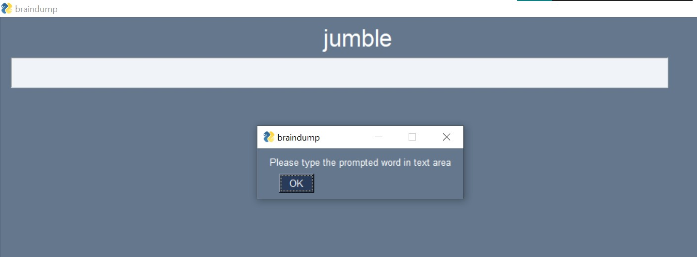
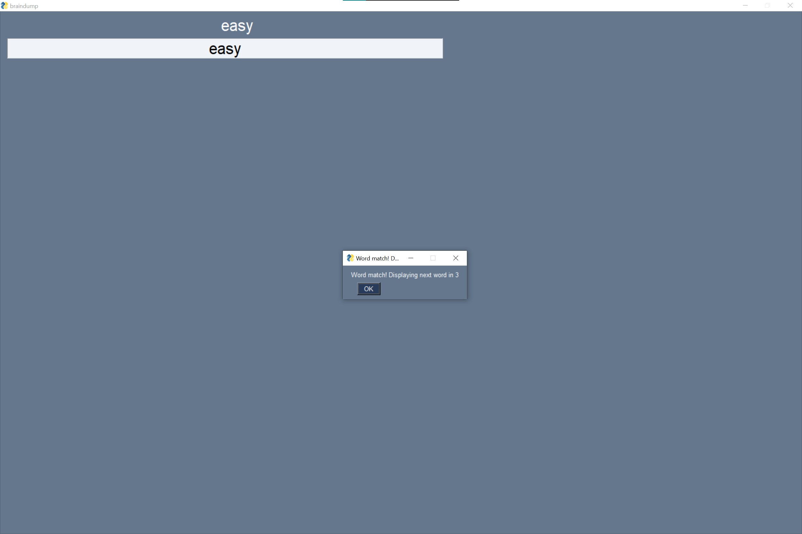

# Brain Dump - Thought to text

Goal: Recognize words in my thoughts and be able to write them as text in realtime

Approach:

Experiment
- Record raw eeg epoch as user is typing
    - start CuriaIO-rc3 - to log key data
    - use the curiarecorder - to record the data from different streams
    `.\curiarecorder\curiarecorder.exe record * data/session00x.csv`
- Prompt a word and have user type it
    - `python.exe collect.py session00x`

Preprocessing Data

- choosing samples
    - find timestamp for every valid word entry in keystroke data
    - filter eeg data with keystroke data for every word sample
    - pick each entry for every sample

- selecting what channels to use
    - apply a band pass filter to remove harmoinic noise
    - visualize fft for a single sample and pick the channel with the highest (but not weirdest)
        - x axis bins (0-55), y- axis voltage
        - plot all channels together
    - after picking a single channel, you're ready to send fft data for that to gpt

- feeding data to gpt
    - get combined df for typing matchings (across different words)
        - loop through word prompts
        - apply current preprocessing and have a data set that contains "word prompt" & fft string pairs
        - use 60:40 split for training and testing
    
    - send fft prompt for channel to gpt "wordprompt: easy; fft: [rrrbs,bsbssbsbs]"
	    - select frequencies between 2-50Hz

    - measure accuracy, precision & recall for examples

(misc)
- record more experiments and performance
    - do the experiment a few different times on different days
- clean up [scratch.ipynb](./scratch.ipynb) into a shareable script

Inference
how do we do inteference realtime on notion